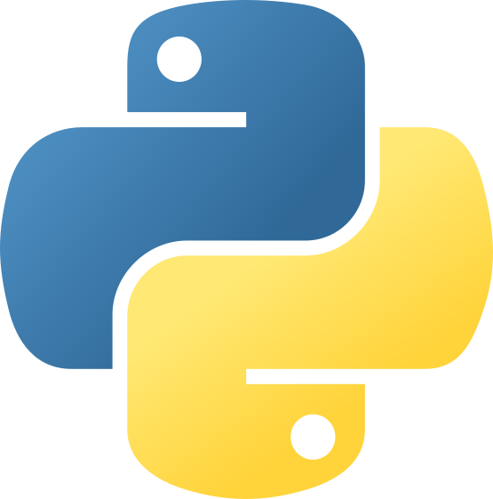
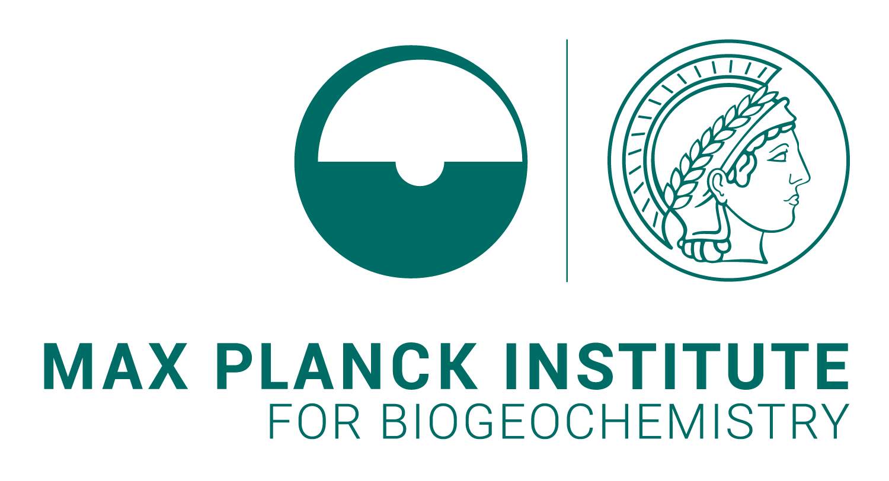
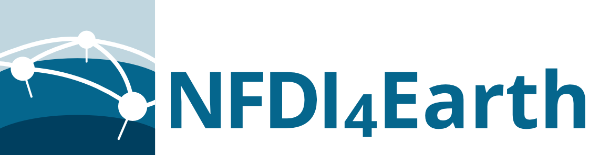

# Spatial Data Science across Languages (SDSL) 2026

__16-17 (+18) September, 2026, Jena, Germany__

## Goals

Spatial data science tools are not limited to a single programming language, with large communities organised around R, Python or Julia.
The SDSL workshop provides a space to bridge the communities and establish cross-language interaction between developers and users.
SDSL seeks to advance this field by bringing together the communities from the common and emerging programming languages used for data science to discuss interoperability, methodological developments, and shared challenges such as interfacing upstream libraries (including GDAL, GEOS, and PROJ), packaging and distributing software, and managing user and developer communities.

The previous installments [2023](https://r-spatial.org/sdsl/), [2024](https://spatial-data-science.github.io/2024/) and [2025](https://spatial-data-science.github.io/2025/) of the workshop identified several paths for common work and the third edition plans to follow-up on these efforts as well as open the discussion on topics that have not been addressed so far.
Topics and issues raised in previous editions will be pushed further through dedicated hackathons.

The topics you may expect to be part of the discussion include:

## Topic list

- File formats and data connectivity
- Conventions and open standards
- Spherical geometries
- Discrete Global Grid Systems (DGGS)
- Web mapping, visualisation and image pyramids
- Big data handling and access including EO and STAC catalogs
- Cloud-optimized data formats
- Distributed data processing
- Spatial statistics and ML
- Interoperability between packages and languages
- Learning resources and teaching methods
- Communities, governance and funding models

However, the list is not exhaustive or fixed.

The goal of the workshop is to attract a maximum of 30 on-site attendees.

## Venue

The workshop will be held on 16 & 17 September 2026, at the [Max Planck Institute for Biogeochemistry](https://www.bgc-jena.mpg.de/).

The address is:

> Mälzerstraße 5 
> 07745 Jena 
> Germany 

[OpenStreetMap](https://www.openstreetmap.org/way/951671578)

There will be a Hackthon on 18 September 2026 at the main building of the Max Planck Institute.

The address is:

> Hans-Knöll-Straße 10a
> 07745 Jena
> Germany

[OpenStreetMap](https://www.openstreetmap.org/way/233210585)

## Program Committee

- [Fabian Gans](https://bgc-jena.mpg.de/person/fgans)
- [Felix Cremer](https://bgc-jena.mpg.de/person/fcremer)
- [Martin Fleischmann](https://martinfleischmann.net/)
- [Edzer Pebesma](https://www.uni-muenster.de/Geoinformatics/institute/staff/index.php/119/Edzer_Pebesma)
- [Maarten Pronk](https://www.deltares.nl/en/expertise/our-people/maarten-pronk)
- [Yomna Eid](https://www.uni-muenster.de/Geoinformatics/institute/staff/index.php/413/Yomna_Eid)

## Local committee

- Mélanie Weynants
- Felix Cremer
- Fabian Gans
- Markus Zehner

In case of any queries, please contact Fabian ([fabian.gans@bgc-jena.mpg.de](mailto:fabian.gans@bgc-jena.mpg.de)).

## Registration

Please register for on-site or online participation using [this form](https://survey.academiccloud.de/f/861612?lang=en). 
Note that the number of on-site participants is limited. The programme committee will select the final list of on-site participants by end of July 2026.

### Online Attendance

Online attendance to the main workshop will be possible.
<!-- Online participation is free of charge. If you plan to join the symposium online, please indicate that in the registration form. -->

## Discord

SDSL has a Discord server that will be used for communication during the workshop. Please join via [https://discord.gg/HJRKEJsmrr](https://discord.gg/HJRKEJsmrr).

## Program

The topic selection is preliminary and will be changed accordingly.

### Wednesday 16th

Day 1: 9:00 - 17:00 CET

### Thursday 17th

Day 2: 9:00 - 17:00 CET

### Friday 18th

On-site Dev Day open for whoever wants to join and work on projects that arise during the workshop.

## Supported by

